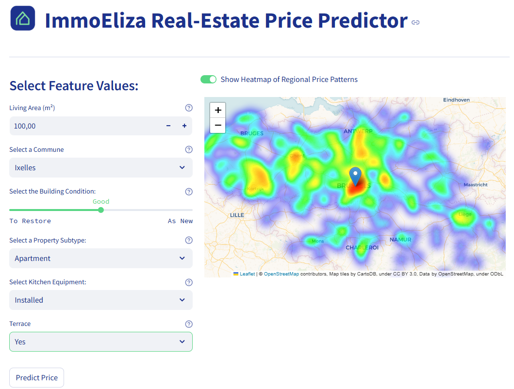

# ImmoEliza Property Price Predictor 📊🏠

Welcome to the **ImmoEliza Property Price Predictor**! 
This app is the fourth and final phase of the *ImmoEliza project*, which is part of the BeCode Data Science and AI Bootcamp.

## Description

The project's purpose is to deliver a Streamlit-based application that integrates a K-Nearest Neighbors (KNN) regression model, allowing users to estimate property prices for Belgium, based on feature values used for machine learning such as living area, commune, building condition, property subtype, kitchen equipment and availability of a terrace. In the background, the app loads the coordinates of communes as well as average taxable income and the distance to the nearest large city from the original dataset. Next, it encodes and standardizes the data and computes a price prediction using the trained machine learning model.

The provided map shows the location of the selected commune using coordinates from the original dataset. A toggle switch allows users to enable or disable a heatmap displaying prices per square meter across Belgium. When enabled, the heatmap visually highlights areas with lower to higher property prices, offering the users insights into regional pricing patterns.

**Limitations:**

* Predictions rely on the quality of input data. Inaccurate values can lead to errors.
* Currently, the user can only choose from a small number of features. This is due to the use of a KNN regression model which struggles with high-dimensional data (for a detailed explanation, see below).
* Predictions depend heavily on the quality and coverage of the dataset the model was trained on. This data may contain imbalanced representation of different properties and features. As a result, certain feature combinations may result in inaccurate predictions.
* The app currently does not support real-time updates or external datasets.
  
* Improvements could include:
  * Expanding feature choice and countries.
  * Improving predictions by addressing data imbalances.
  * Enhancing feature engineering.
  * Integrating real-time market trends.
  * Adding other machine learning models for comparison and better accuracy. 


## Why the App Uses a Limited Number of Features for Price Prediction
The app currently only allows users to choose from a small set of features, which include living area, commune, building condition, property subtype, equipped kitchen, and terrace. Additionally, commune coordinates, average taxable income, and distance to the nearest large city are pre-loaded as these features showed to significantly improve the model metrics. Since these features depend on the selected commune, they are added automatically, without the need for user-input.

These features were carefully selected based on the performance of the KNN regression model during its development and testing. Adding more features led to worse evaluation metrics, which can be attributed to the following factors:
* Curse of Dimensionality: KNN struggles with high-dimensional data, where distance calculations become less meaningful, leading to decreased model performance.
* Overfitting: Including too many features can cause the model to overfit, meaning it performs well on training data but poorly on new data.
* Irrelevant Features: Extra features can introduce noise, making the model more complex without improving its accuracy.

## Installation

The app can be accessed online via Streamlit as explained under 'Usage'. To set up and run the app locally, follow the steps below:

1. **Clone the Repository and Navigate to Directory**
   ```bash
   git clone https//github.com/Miriam-Stoehr/challenge-app-deployment.git

   cd challenge-app-deployment
   ```
2. **Install Dependencies**
    
    Install the required libraries:

    ```bash
    pip install -r requirements.txt
    ``` 


## Usage

1. Access the app online on Streamlit via the link https://immoeliza-property-price-prediction.streamlit.app/
   * Alternatively: Follow the instructions for installation and run the script locally with the command:
  
      ```bash
      streamlit run app.py
      ```
      and access the app via your browser (http://localhost:8501).
   
2. Fill in the property details, such as zip code or commune, living area, building condition, kitchen details, etc.

3. When selecting a commune, the app displays a map showing the commune's location. A heatmap provides information regarding regional price patterns that can be turned off using the toggle switch.

4. Click "Predict Price" to see the estimated value.

## File Structure

```plaintext

challenge-app-deployment
├── .streamlit/            # Streamlit-specific configurations
│   └── config.toml
├── data/                  # Real-estate dataset for heatmap
│   └── exported_data.csv
├── images/                # App visuals (e.g., logo)
│   ├── logo.png
│   └── screenshot.png
├── model/                 # Saved KNN model and scaler
│   ├── knn_model.pkl
│   └── knn_scaler.pkl
├── predict/               # Prediction logic
│   └── prediction.py
├── preprocessing/         # Data cleaning and preprocessing logic
│   └── cleaning_data.py
├── app.py                 # Main Streamlit app
├── config.py              # Configuration settings for paths and options
├── README.md              # Project documentation
├── requirements.txt       # Python dependencies

```
## Explanation of Main Scripts and Files

### Main Scripts

* `app.py`

* `preprocessing/cleaning_data.py`

* `predict/prediction.py`

### Key Files

* `data/exported_data.csv`
  * **Description:** The dataset used during machine learning containing real-estate data, including commune names, latitude, longitude, etc..
  * **Purpose:**
    * Adds location-related data relevant for price prediction, but not to be provided by the user (coordinates, average taxable income per commune, distances to the nearest large city)
    * Contains essential data (e.g. commune coordinates) for geospatial functionalities.
    * Provides commune-specific data for map visualization and heatmap creation.

* `.streamlit/config.toml`
  * **Description:** Configures the Streamlit app's appearance.
  * **Purpose:**
    * Defines custom page settings, such as wide layout, background and colors.

* `images/logo.png`
  * **Description:** A visual branding element used in the app's header.
  * **Usage:**
    * The logo can be replaced by either replacing the file while keeping the filename, or by changing the filename in `config.py`.

* `model/knn_model.pkl`
  * **Description:** The saved K-Nearest Neighbors regression model trained during the machine learning phase.
  * **Purpose and Usage:**
    * Loaded by the `Predictior` class to perform price predictions.
    * Contains the learned relationships between property features and prices.

* `model/knn_scaler.pkl`
  * **Description:** A saved scaler object used during the training phase to normalize input data.
  * **Purpose and Usage:**
    * Ensures new input data matches the scale of the training data for accurate predictions.
    * Used by the `predict()` method in `prediction.py`

* `config.py`
  * **Description:** Stores configuration constants used throughout the app.
  * **Purpose and Usage:**
    * Defines paths to key files (`MODEL_PATH`, `DATA_PATH`)
    * Provides reusable lists for dropdowns (e.g building conditions, property subtypes)

* `requirements.txt`
  * **Description:** Lists all Python dependencies required to run the project.
  * **Purpose and Usage:**
    * Ensures consistent setup across environments.
    * Includes essential libraries like `streamlit`, `pandas`, and `folium`.

## Visuals

App preview:



## Contributors

* **Solo Project**
  
  Built with 💻 and ☕ by Miriam Stoehr, as part of the BeCode Data Science and AI Bootcamp 2024/2025.


## Personal Situation

This app is the fourth and final phase of the **ImmoEliza project**, developed during BeCode's Data Science and AI Bootcamp. The stages of the project included:

1. **Web scraping:** Creating a dataset based on data collected from a real estate platform.
2. **Data Analysis:** Processing and analyzing market patterns and trends.
3. **Machine Learning:** Building a Machine Learning model (my group's focus was on KNN regression) to predict property prices.
4. **Deployment:** Developing this app to deploy the model interactively.
